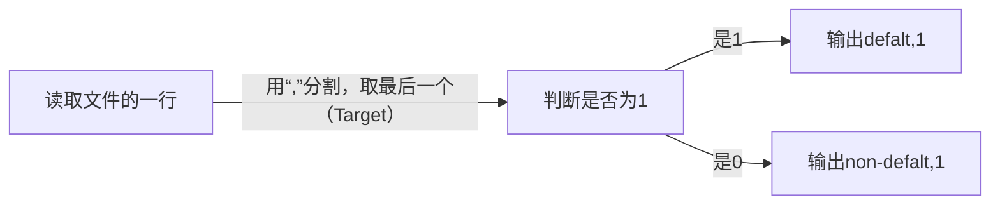
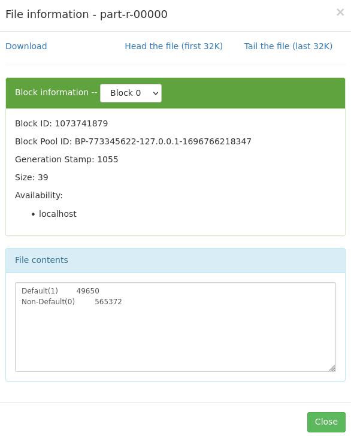
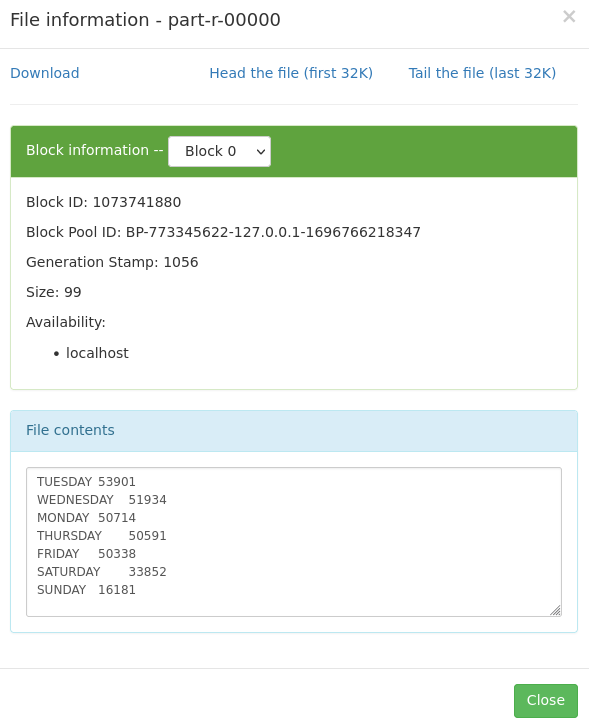
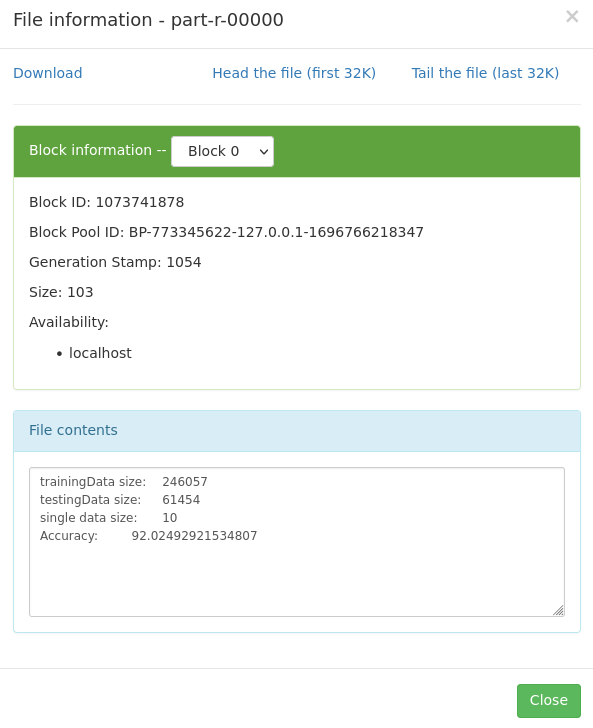

# 实验2实验报告

<center>
    姓名：许霁烨<br>
    学号：211275024
</center>

## 前期准备

创建新项目，注意，创建新项目后同样需要新建文件`log4j.properties`和修改配置文件`pom.xml`

同之前的实验一样，将实验所需的`application_data.csv, columns_description.csv`放到hadoop filesystem中：

```cmd
[hadoop@localhost java]$ hadoop fs -put application_data.csv /exp2/input
[hadoop@localhost java]$ hadoop fs -put columns_description.csv /exp2/input
```

> 注意：这里hadoop已经打开且在hadoop fs中已经创建好文件夹

hadoop filesystem中目录树如下

```
exp2
├── input
│   ├── application_data.csv
│   └── columns_description.csv
└── output
```

## Task1

> 编写MapReduce程序，统计数据集中违约和⾮违约的数量，按照标签**TARGET**进⾏输出，即1代表有违约的情况出现，0代表其他情况。

### 设计思路：

- Mapper



> map的参数：`map(<key>,<value>,<type(key_out)>,<type(value_out)>)`

```java
public static class TokenizerMapper extends Mapper<Object, Text, Text, IntWritable> {
    //<key value, type(key_out), type(value_out)>
    // 定义一个IntWritable对象,value为1,表示计数(Default or not)
    private final static IntWritable one = new IntWritable(1);
    // 定义Text对象,用于存储分类标签
    private Text word = new Text();
    // Map任务
    public void map(Object key, Text value, Context context) throws IOException, InterruptedException {
        // 将输入的Text转为字符串数组,以空格分割
        String[] data = value.toString().split(",");
        // 检查最后一个元素,TARGET列的值
        if (data[data.length-1].equals("1")) {
            // TARGET为1表示违约,将word设置为"Default"
            word.set("Default(1)");
        } else {
            // 否则为非违约,设置为"Non-Default"
            word.set("Non-Default(0)");
        }
        // 输出map结果,Text为分类标签,IntWritable为计数1
        context.write(word, one);
    }
}
```

- Reducer

  从mapper收到的数据形式如下：`<default,[1,1,1,1....]>, <Non-Default(0),[1,1,1,1...]>`因此，只需要将违约和没有违约中的1分别求和即可。

  > reduce函数的参数：`reduce(<mapper中输出的key>,<map中输出key对应的value的集合>,<输出的对象>)`

  ```java
  public static class IntSumReducer extends Reducer<Text,IntWritable,Text,IntWritable> {
          private IntWritable result = new IntWritable();
          public void reduce(Text key, Iterable<IntWritable> values, Context context) throws IOException, InterruptedException {
              if (key.toString().equals("Non-Default(0)")) {
                  // 统计key为0的数量
                  int sum0 = 0;
                  for (IntWritable val : values) {
                      sum0 += val.get();
                  }
                  result.set(sum0);
                  context.write(new Text("Non-Default(0)"), result);
              } else if (key.toString().equals("Default(1)")) {
                  // 统计key为1的数量
                  int sum1 = 0;
                  for (IntWritable val : values) {
                      sum1 += val.get();
                  }
                  result.set(sum1);
                  context.write(new Text("Default(1)"), result);
              }
          }
      }
  ```

### 实验结果：



### 遇到的问题：

注意，`data[data.length-1]`的值不是只有0和1，还有可能是“Target”（也就是列名），因此在处理的时候需要特判一下第一行

## Task2

> 编写MapReduce程序，统计⼀周当中每天申请贷款的交易数**WEEKDAY_APPR_PROCESS_START**，并按照交易数从⼤到⼩进⾏排序。

### 设计思路：

本题在统计每一天的交易数量的思路与Task1相同，每读取一行就读取一行中的第26个元素（`WEEKDAY_APPR_PROCESS_START`列），然后将对应列输出`<weekday,1>`，核心代码如下：

```java
String[] data = value.toString().split(",");
if (data[25].equals("MONDAY")) {
    word.set("MONDAY");
} 
...
```

这样，在Reducer中，我们便能统计出每一天的交易数量了，但不能直接输出，因为还需要从小到大排序。为了实现根据交易升序排序，这里使用了`TreeMap`，介绍如下，因此，我们只需要将每一天的数据放入到`TreeMap`中，即可自动排序，核心代码如下：

>`TreeMap<Integer, Text>` 是 Java 中的一种有序映射，它基于红黑树实现。其具有**有序性：** `TreeMap` 中的元素是有序的，它会按照键的自然顺序（或者通过提供的比较器）进行排序。在您的代码中，`TreeMap<Integer, Text>` 表示一个按照整数键**升序排序**的映射。

```java
private Map<Integer, Text> resultMap = new TreeMap<>();
public void reduce(Text key, Iterable<IntWritable> values, Context context) throws IOException, InterruptedException {
    int sum = sum(values);
    if (key.toString().equals("MONDAY")) {
        result.set(sum);
        resultMap.put(sum, new Text(key));//放入到TreeMap中，依次排序
} 
```

最后，再调用`cleanup`方法，将`TreeMap`中排序好的数据输出即可

>在 MapReduce 中，`cleanup` 方法是在**每个 Reducer 任务执行完毕**后调用的一个回调方法。它允许执行一些最终的清理工作，通常用于处理最终的计算结果。

```java
protected void cleanup(Context context) throws IOException, InterruptedException {
    // 迭代排序后的条目并将其写入上下文
    for (Map.Entry<Integer, Text> entry : resultMap.entrySet()) {
        result.set(entry.getKey());
        context.write(entry.getValue(), result);
    }
}
```

### 实验结果：



### 遇到的问题：

`TreeMap`数据类型默认是按照键**升序排序**的，为了实现实验要求的降序排序，还需要设置参数

## Task3

根据application_data.csv中的数据，基于MapReduce建⽴贷款违约检测模型，并评估实验结果的准确率。

### 模型选择：KNN

KNN算法是一种基于实例学习的监督学习算法,其基本思想是:如果一个样本在特征空间中的k个最相似(即特征空间中**最邻近**)的样本中的大多数属于某一个类别,则该样本也属于这个类别。

> 如何计算距离——欧式距离
> $$
> d(\mathbf{x}, \mathbf{y}) = \sqrt{\sum_{i=1}^{n}{(x_i - y_i)^2}}
> $$

该算法的输入为特征向量组成的训练样本数据集以及待分类的特征向量,输出为待分类特征向量的类别。

### 数据预处理：

为了方便后续实验，本实验选取了如下指标：

| CODE_GENDER | FLAG_OWN_CAR | FLAG_OWN_REALTY | CNT_CHILDREN | AMT_INCOME_TOTAL | AMT_CREDIT | NAME_INCOME_TYPE | NAME_EDUCATION_TYPE | FLAG_DOCUMENT_3 |
| ----------: | -----------: | --------------: | -----------: | ---------------: | ---------: | ---------------: | ------------------: | --------------: | 

- 对于numeric feature：进行Max-min归一化
- 对于category feature：
  - `ODE_GENDER, FLAG_OWN_CAR, FLAG_OWN_REALTY`是二分类的，因此只需要设置0,1即可
  - `NAME_INCOME_TYPE`根据是否有工作（有工作：Working,Commercial associate,State servant,Businessman；没工作Pensioner,Unemployed,Student,Maternity leave）划分为0,1
  - `NAME_EDUCATION_TYPE`：有偏序关系的，因此可以从学历低到学历高依次赋值，然后再归一化

### 设计思路：

- Map阶段：

  Map阶段主要实现的功能是读取数据，并**划分成训练集和数据集**，在本实验中，划分数据集的依据是随机选取80%的数据作为训练集，其余20%作为测试集。

  ```java
  Random random = new Random();
  int randomNumber = random.nextInt(100);
  
  // 根据随机数判断是否为训练集数据
  if (randomNumber < TRAIN_PERCENT) {
      context.write(new Text("train"), listToString(list));
  } else {
      context.write(new Text("test"), listToString(list));
  }
  ```

  Map阶段输出的`<key,value>`即为：

  ```python
  <"train","feature1,feature2,...,Target">
  <"test","feature1,feature2,...,Target">
  ```

  其中，key和value的数据类型均为`Text`

- Reduce阶段：

  - 在`reduce`函数时，主要功能是用两个**二维数组**分别保存Map阶段传下来的训练集和测试集，这样操作后续cleanup函数，就已经有了完整的测试集数据和数据集数据，reduce函数输出的函数例如：

    ```python
    train_data=[[feature1,feature2,...,Target],[feature1,feature2,...,Target],...[]]
    test_data=
    ```

  - 在`cleanup`函数时
  
    - 对每个测试数据,计算它与训练集中每个数据的欧式距离;
  
      ```java
      //欧式距离计算函数
      private double calculateEuclideanDistance(List<Integer> data1, List<Integer> data2) {
          if (data1.size() != data2.size()) {
              throw new IllegalArgumentException("Data sizes do not match");
          }
      
          double sum = 0.0;
          for (int i = 0; i < data1.size()-1; i++) {
              int diff = data1.get(i) - data2.get(i);
              sum += Math.pow(diff, 2);
          }
      
          return Math.sqrt(sum);
      }
      ```
  
    - 根据欧式距离排序,找到最近的K个样本;
  
      用了一个优先级队列，记录距离最小的K个样本的`<距离，类别>`
  
      ```java
      PriorityQueue<Pair<Double, Integer>> minDistanceQueue = new PriorityQueue<>(K, Comparator.comparing(Pair::getKey));
      ```
    
      ```java
      for (List<Integer> testData : testingData) {
          // 清空优先级队列
          minDistanceQueue.clear();
          // 计算与每个trainingData的欧式距离，并将距离和最后一个值加入优先级队列
          for (List<Integer> trainData : trainingData) {
              double distance = calculateEuclideanDistance(testData, trainData);
              int lastValue = trainData.get(trainData.size() - 1);
              minDistanceQueue.offer(new Pair<>(distance, lastValue));
              // 如果队列中的元素数量超过k个，则移除距离最大的元素
              if (minDistanceQueue.size() > K) {
                  minDistanceQueue.poll();
              }
      }
      ```
    
    - 统计这K个最近样本中,类别为1的样本个数，如果个数大于K/2,则预测该测试数据类别为1,否则预测为0
    
      ```java
      // 统计优先级队列中最后一个值为1的数量
      int count = 0;
      for (Pair<Double, Integer> pair : minDistanceQueue) {
          if (pair.getValue() == 1) {
              count++;
          }
      }
      
      // 记录预测结果
      int prediction = count > K / 2 ? 1 : 0;
      int actualValue = testData.get(testData.size() - 1); // 假设真实值在数据集的最后一个位置
      Pair<Integer, Integer> resultPair = new Pair<>(prediction, actualValue);
      predictionResults.add(resultPair);
      ```
    
    - 将预测结果与测试数据的真实类别比较,计算分类准确率。
    
      ```java
       private double calculateAccuracy(List<Pair<Integer, Integer>> predictions) {
          int correctPredictions = 0;
          int totalPredictions = predictions.size();
      
          for (Pair<Integer, Integer> prediction : predictions) {
              int predictedValue = prediction.getKey();
              int actualValue = prediction.getValue();
      
              if (predictedValue == actualValue) {
                  correctPredictions++;
              }
          }
      
          double accuracy = (double) correctPredictions / totalPredictions * 100;
          return accuracy;
      }
      ```
    
      

### 实验结果：



### 遇到的问题：

本题代码量较大，在debug中出现以下需要注意的问题：

- Map和Reduce阶段的**输出输入类型**千万要写正确，而且是可以输出的变量类型
- Reduce阶段不能同时拿到训练集和测试集，因此需要在Reduce结束后的cleanup函数实现KNN模型
- Map阶段输出的Value好像不能是iterable<Intwritable>，我的操作是先输出为Text格式，然后再在Reduce中转回数值型数据
