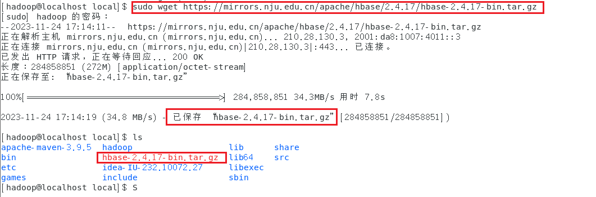
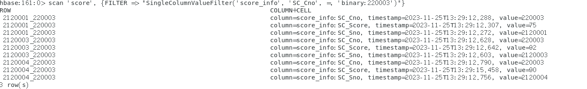
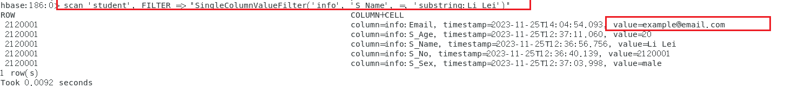

# 实验3

## HBase安装

### HBase下载

https://mirrors.nju.edu.cn/apache/hbase/2.4.8/hbase-2.4.8-bin.tar.gz有问题，查看https://mirrors.nju.edu.cn/apache/hbase/后发现现在只有如下版本，选择2.5.5版本


`sudo wget https://mirrors.nju.edu.cn/apache/hbase/2.5.5/hbase-2.5.5-hadoop3-bin.tar.gz`



解压：`sudo tar xzvf hbase-2.5.5-hadoop3-bin.tar.gz `

> `xzvf`参数是解压tar.gz文件的参数

更改名称（hbase-2.5.5->hbase）


### 修改`hbase-env.sh`

`vim hbase-env.sh `

添加如下内容：

```shell
#本机的java路径
export JAVA_HOME=/usr/lib/java-1.8.0/jdk1.8.0_381
#HBase 将管理自己的 ZooKeeper 实例
export HBASE_MANAGES_ZK=true
#为了避免 HBase 在启动时查找 Hadoop 的类路径，这一行很重要！！
export HBASE_DISABLE_HADOOP_CLASSPATH_LOOKUP="true"
```

### 修改`hbase-site.xml`

`vim hbase-site.xml`

文件配置修改如下：

```xml
<!--修改成true 分布式-->
<property>
    <name>hbase.cluster.distributed</name>
    <value>true</value>
  </property>

  <property>
    <name>hbase.tmp.dir</name>
    <value>/usr/local/hbase/data/tmp</value>
  </property>

  <property>
    <name>hbase.unsafe.stream.capability.enforce</name>
    <value>false</value>
  </property>

  <!--HBase的数据保存在HDFS对应目录-->
  <property>
    <name>hbase.rootdir</name>
    <value>hdfs://localhost:9000/hbase</value>
  </property>

  <!--配置ZK的地址,有5个节点启用ZooKeeper-->
  <property>
     <name>hbase.zookeeper.quorum</name>
     <value>localhost:2181</value>
  </property>

<!--主节点和从节点允许的最大时间误差-->
<property>
  <name>hbase.master.maxclockskew</name>
  <value>180000</value>
</property>

<!--zookeeper数据目录-->
<property>
  <name>hbase.zookeeper.property.dataDir</name>
  <value>/usr/local/hbase/data/zookeeper</value>
</property>
```

### 伪分布式运行

1. 先启动`hadoop`

2. 启动`Hbase`

   `./bin/start-hbase.sh`
   
   
   
   


3. 关闭`HBase`

   `./bin/stop-hbase.sh`

## 实验内容

### Task1: 设计并创建合适的表

1. 进入shell

   

2. 学生表的构建

   

   - 创建表`create '<table_name>','<列族名>'`

   - 添加一列`put <table>,<rowkey>,<family:column>,<value>`

   - 查看表：`scan '<table_name>'`

     

   3. 创建课程表

      与创建学生表类似

      

   4. 创建选课表

      > 注意，这里第一列不是唯一的，因此不能作为rowkey，这里我是用的是`<SC_Sno>_<SC_Cno>`保证rowkey的唯一性

      

### Task2:查询选修BigData的学生的成绩

HBase是一个面向列的分布式数据库，因此它不支持内部关联查询。所以本任务使用多次使用**过滤器**查询数据


> | 比较器                  | 表达式缩写             |
> | ----------------------- | ---------------------- |
> | BinaryComparator        | binary:值              |
> | BinaryPrefixComparator  | binaryprefix:值        |
> | BitComparator           | bit:值                 |
> | NullComparator          | null                   |
> | RegexStringComparator   | regexstring:正则表达式 |
> | **SubstringComparator** | **substring:值**       |

1. 查询BigData的课程号

   这里使用值过滤器和子字符串比较器

   ```shell
   scan 'courses', FILTER => "SingleColumnValueFilter('course_info', 'C_Name', =, 'substring:BigData')"
   ```

   

   可以看到，BigData的课程号是220003

2. 查询220003的成绩

   

   可以看到

   - 学号为2120001的同学成绩为75
   - 学号为2120003的同学成绩为92
   - 学号为2120004的同学成绩为94

3. 根据学号查询姓名

   多次使用`get 'student', '2120001'`获取每位同学的姓名，最后可以看到

   

   - Li Lei的同学成绩为75
   - Zhang Li的同学成绩为92
   - Li Ming的同学成绩为94

### Task3:学生表增加电子邮件列

直接多次put即可。


如果要新增一个**列族**，那么可以先用altert添加一个列族名，然后再put也可以

```cmd
alter 'student', {NAME => 'Email'}
```

### Task4:查询Li Lei的电子邮件；

该任务比较简单，就与Task2中的过滤相同使用即可，可以看到Li Lei 的电子邮箱是example@email.com



### Task5: 删除所创建的表

这题就更简单了，正常使用语法即可

> 删除表操作：
>
> ```cmd
> disable <table>
> drop <table>
> ```


### Web UI截图


## 问题总结及解决方案

### 关于磁盘扩容问题

在之前我的/usr文件夹内内存不足，如果只用vmvare的内存分配也不能将内存正确扩充到我的工作文件夹下，因此参考了这篇文章，成功扩容。

[Linux CentOS 7分配的磁盘空间不足，空间扩展方法，保姆级操作](https://blog.csdn.net/xudingzhang/article/details/129905679?utm_medium=distribute.pc_relevant.none-task-blog-2~default~baidujs_baidulandingword~default-0-129905679-blog-57463340.235^v38^pc_relevant_anti_vip_base&spm=1001.2101.3001.4242.1&utm_relevant_index=1)

### Tips1:创建快捷启动方式：

修改环境变量：

```cmd
sudo vim ~/.bashrc
```

添加如下别名：

```bash
alias starthadoop='/usr/local/hadoop/sbin/start-all.sh'
```

就可以快捷启动hadoop

### Tips2:快速查找文件路径

可以用which快速查询路径

```cmd
which hadoop
```

### 关于权限问题（很重要！）

之前配置的时候没有给hadoop用户设置管理员权限，在操作的时候都用sodo，这样在后续启动HBase的时候会出现一点问题。因此，**强烈建议**给用户设置hbase的管理员权限

`````cmd
sudo chown -R hadoop:hadoop hbase
`````

- `chown` 是改变文件或目录所有者的命令。
- `-R` 选项表示递归地应用于目录及其所有子目录和文件。
- `hadoop:hadoop` 是目标所有者和所属组的标识。在这里，文件/目录的所有者将设置为 `hadoop` 用户，所属组也将设置为 `hadoop` 组。
- `hbase` 是要更改所有者的目标文件或目录的名称。

### 关于HBase和Hadoop冲突问题

之前运行的时候一直会出现SLF4J冲突什么的。后来解决方案是在env中添加了

```sh
export HBASE_DISABLE_HADOOP_CLASSPATH_LOOKUP="true"
```

好像就好使了

## 其他思考

HBase是一个基于Hadoop生态的分布式列型数据库,具有高可靠性、高并发读写和易扩展等优点,适合PB级大数据的存储。原因在于它基于HDFS文件系统实现了数据的高可靠存储,利用HBase的分布式架构可以对数据进行自动分区,实现对大规模数据的横向扩展。同时,它通过MemStore和SSTable的结构优化了对列式数据的存储 efficiency 和读取性能。这使得它可以提供每秒数十万次的读写吞吐。

但是,HBase作为一个非关系型NoSQL数据库,它也存在一定的缺陷。比如部署和使用复杂度较高,需要搭建整个Hadoop生态圈,不支持SQL,学习和使用成本较高。此外,HBase无法提供强一致性保证,在极端情况下可能会出现读取不一致数据的问题。而且HBase的读放大问题也会对某些读密集场景的性能产生一定影响。