# 实验四实验报告

[TOC]


## Spark安装与配置

本次实验的使用的是**IDEA+Scala**

安装配置的主要参考网站如下：

> [在idea 2021 上 配置本地 scala 2.12 spark 3.0.2 开发环境](https://blog.csdn.net/wangyaninglm/article/details/116004739)
>
> [解决java.io.FileNotFoundException: HADOOP_HOME and hadoop.home.dir are unset.的错误](https://blog.csdn.net/lvoelife/article/details/133349627?spm=1001.2101.3001.6650.3&utm_medium=distribute.pc_relevant.none-task-blog-2%7Edefault%7EYuanLiJiHua%7EPosition-3-133349627-blog-124342759.235%5Ev39%5Epc_relevant_3m_sort_dl_base4&depth_1-utm_source=distribute.pc_relevant.none-task-blog-2%7Edefault%7EYuanLiJiHua%7EPosition-3-133349627-blog-124342759.235%5Ev39%5Epc_relevant_3m_sort_dl_base4&utm_relevant_index=6)

### 下载Spark

下载地址：https://spark.apache.org/downloads.html

 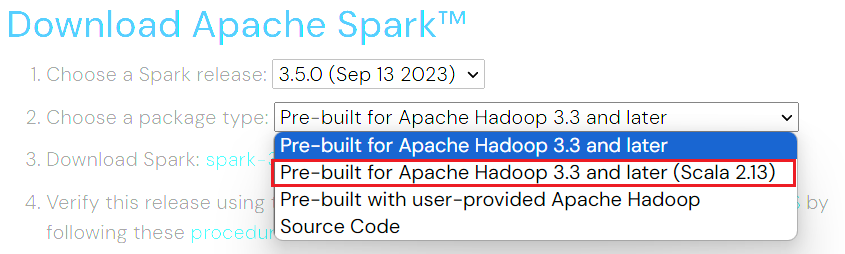

> 注意，这里应该选择第二个，也就是（Scala 2.13)。之前在用第一个的时候出了一点bug，但用第二个就好使了

### IDEA安装Scala插件

这一步很简单，就在`设置-->插件`中搜索并下载scala即可，然后重新启动

 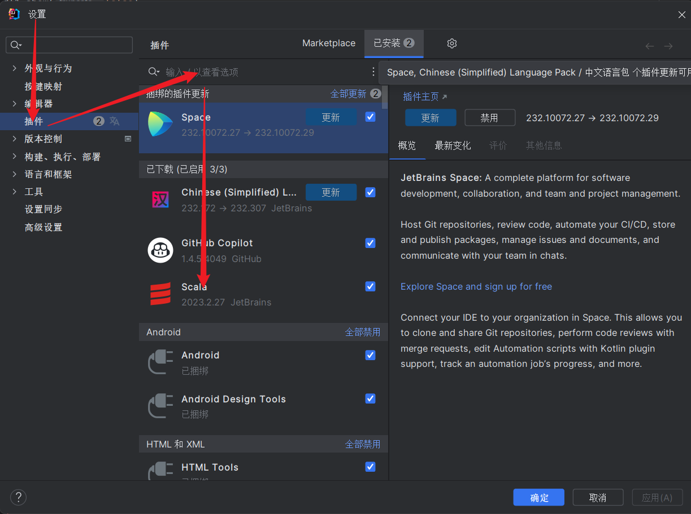

### 新建Scala项目

Spark运行需要java环境，因为之前已经配好了，所以直接导入即可

然后对于Scala SDK，没有下也没关系，直接在创建项目中下载即可。

> 注意对应顺序
>
> 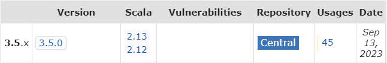 

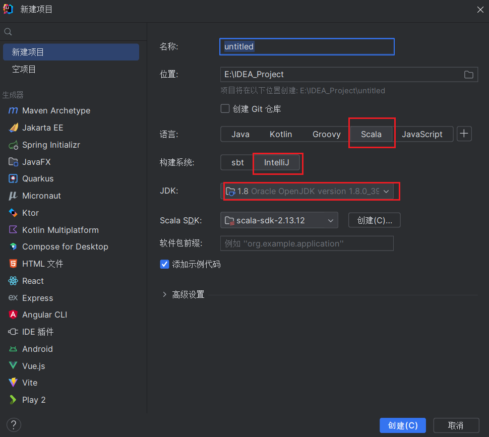 

### 导入Spark的jar包

这一步也比较简单：`项目结构-->库-->+`导入下载的Spark文件中的jar目录即可。

## 任务⼀

### 1. 统计application_data.csv中贷款⾦额**AMT_CREDIT** 的分布情况

#### 思路

1. 首先，用`local[*]`模式创建一个`SparkSession`对象

2. 用`spark.read`方法创建一个DataFrameReader对象，读取application_data.csv，读取结果如下图所示：

    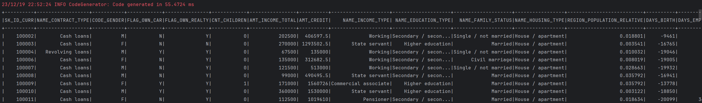

3. 根据AMT_CREDIT分组

   > 使用`groupby`函数，并在 `groupBy` 中，使用 `floor(col("AMT_CREDIT") / 10000) * 10000` 表达式对 `AMT_CREDIT` 列的值进行处理，实现按照每一万为一个范围进行分组。

分组结果如下：全部结果可查看附件

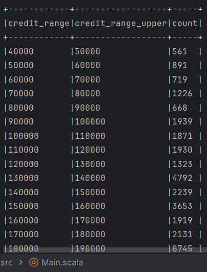 

#### 全部代码

```scala
def Task1_1(df: DataFrame): DataFrame = {
    // 将AMT_CREDIT列转换为Double类型
    val dfWithAmount = df.withColumn("AMT_CREDIT", col("AMT_CREDIT").cast("Double"))

    // 统计 AMT_CREDIT 的分布情况
    val creditDistribution = dfWithAmount.groupBy(
        floor(col("AMT_CREDIT") / 10000) * 10000 as "credit_range"
      )
      .count()
      .orderBy("credit_range")
    //creditDistribution添加一列，计算每个区间的上界
    val creditDistribution1 = creditDistribution.withColumn("credit_range_upper",col("credit_range")+10000)
    //count列和credit_range_upper列交换位置
    val df1 = creditDistribution1.select("credit_range","credit_range_upper","count")
    // 显示结果
    df1.show(false)
    //将其写入csv文件,模式设置为overwrite,保存列名
    df1.write.mode(SaveMode.Overwrite).option("header", "true").csv("E:\\IDEA_Project\\exp4\\src\\output\\Task1_1")
    df1
}
```

#### 在Spark WebUI中查看

 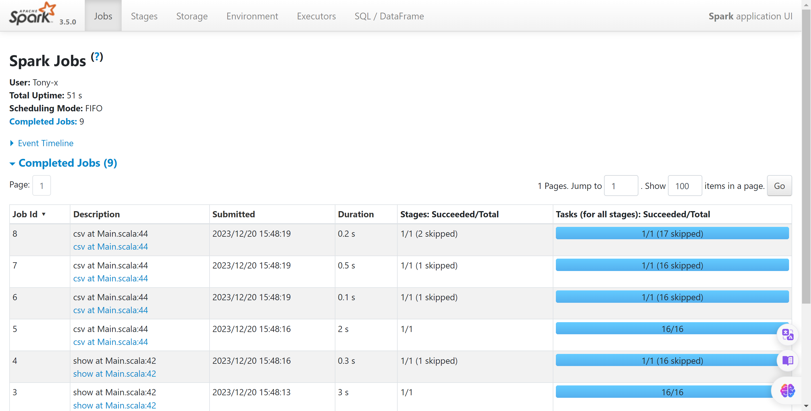

 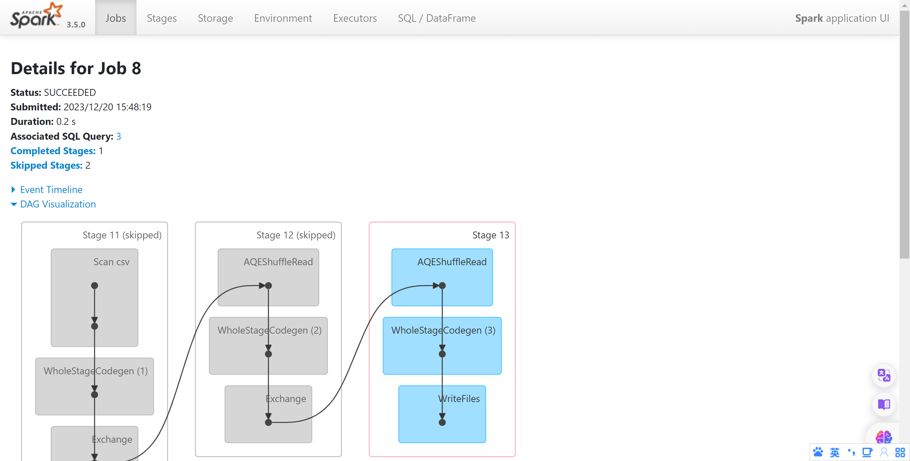

### 2. 统计application_data.csv中AMT_CREDIT-AMT_INCOME_TOTAL最高和最低的各⼗条记录

#### 思路

本题也较为简单，主要流程如下：

1. 获取所需列，并计算`差值`列

2. dataframe排序，取最前面的10个和最后10个

3. 输出结果

    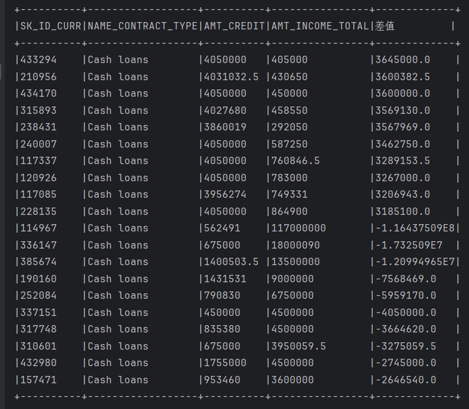

#### 全部代码

```scala
def Task1_2(df: DataFrame): DataFrame = {
    //选取所需列
    val df1 = df.select("SK_ID_CURR","NAME_CONTRACT_TYPE","AMT_CREDIT","AMT_INCOME_TOTAL")
    //添加一列：AMT_CREDIT-AMT_INCOME_TOTAL
    val df2 = df1.withColumn("差值",col("AMT_CREDIT")-col("AMT_INCOME_TOTAL"))
    //选取差值最大和最小的10行
    val df3 = df2.orderBy(col("差值").desc).limit(10)
    val df4 = df2.orderBy(col("差值").asc).limit(10)
    //将两个DataFrame合并
    val df5 = df3.union(df4)
    df5.show(false)
    //保存结果
    df5.write.mode(SaveMode.Overwrite).option("header", "true").csv("E:\\IDEA_Project\\exp4\\src\\output\\Task1_2")
    df5
}
```

#### 在Spark WebUI中查看

 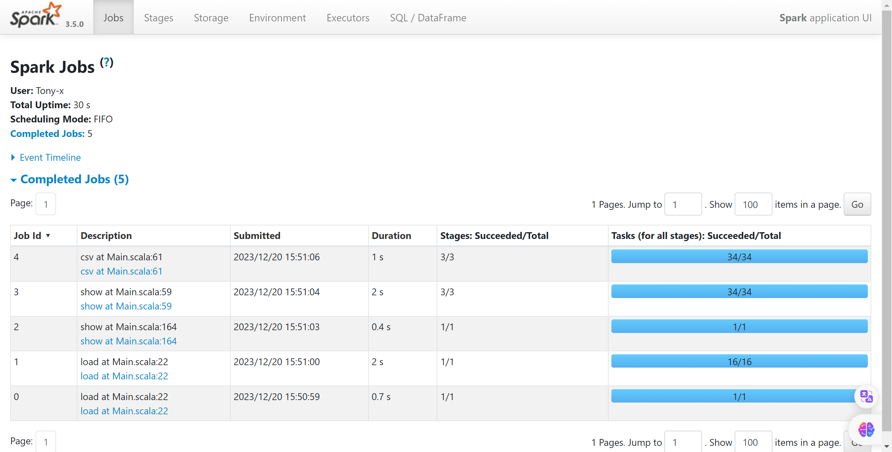

 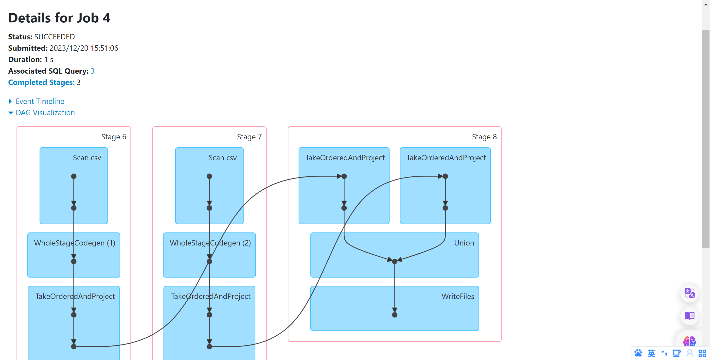

## 任务二

### 1. 统计所有男性客户的⼩孩个数类型占⽐情况

#### 思路

1. 筛选出所需的列，并用filter函数筛选出男性客户

      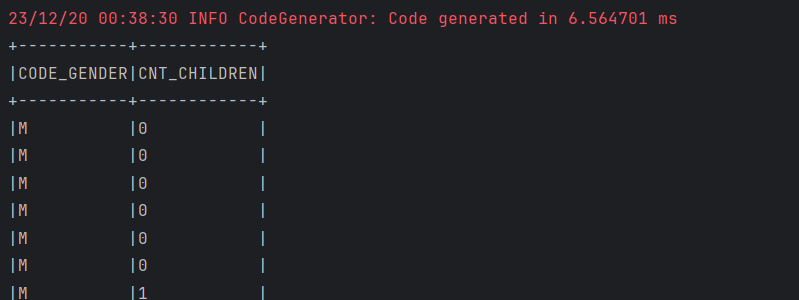

2. 根据`CNT_CHILDREN`使用`groupby`，并用`count()`求出小孩个数的总数，升序排序

   > 注意，读取的数据中`CNT_CHILDREN`默认类型是String，所以需要先转换成int类型再进行升序排序

     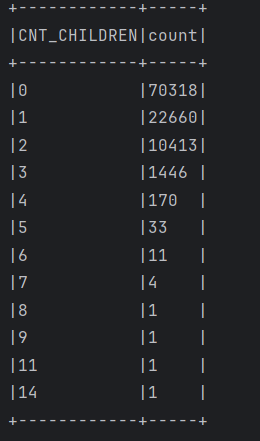

3. 计算全部男性客户，并求出不同小孩数的占比

    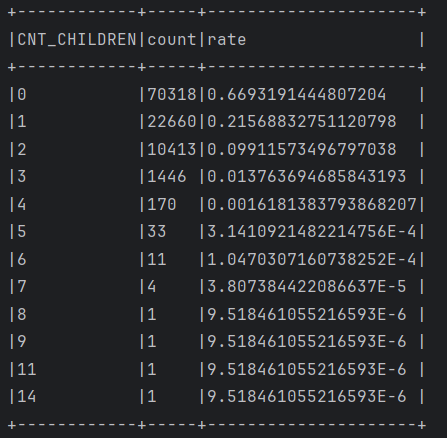

#### 全部代码

```scala
  def Task2_1(df: DataFrame): DataFrame = {
    //统计所有男性客户（CODE_GENDER = M）的 ⼩ 孩个数（CNT_CHILDREN）类型占⽐情况
    val df1 = df.select("CODE_GENDER","CNT_CHILDREN")
    //选取df1中CODE_GENDER = M的行
    val df2 = df1.filter(col("CODE_GENDER") === "M")
    df2.show(false)
    //计算全部男性个数，也就是df2的行数
    val male_count = df2.count()
    //df2根据CNT_CHILDREN分组
    val df3 = df2.groupBy("CNT_CHILDREN").count()
    //CNT_CHILDREN转化成Int类型
    val df4 = df3.withColumn("CNT_CHILDREN",col("CNT_CHILDREN").cast("Int"))
    //根据CNT_CHILDREN升序排列
    val df5 = df4.orderBy(col("CNT_CHILDREN").asc)
    df5.show(false)
    //计算每个CNT_CHILDREN的占比
    val df6 = df5.withColumn("rate",col("count")/male_count)
    df6.show(false)
    df6.write.mode(SaveMode.Overwrite).option("header", "true").csv("E:\\IDEA_Project\\exp4\\src\\output\\Task2_1")
    df6
  }
```

#### 在Spark WebUI查看

 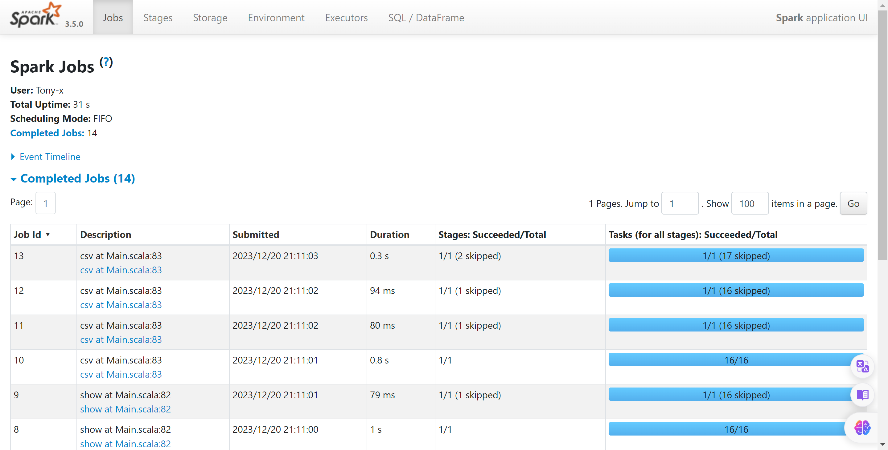

 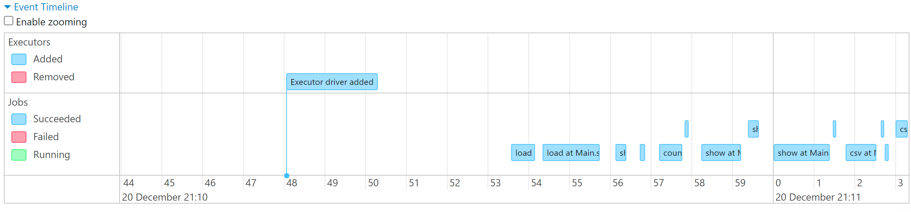

### 2. 统计每个客户每天的平均收⼊，并按照从⼤到⼩排序

#### 思路

1. 选取相关列，并计算平均收入

   > $$
   > avg\_income=\frac{AMT\_INCOME\_TOTAL}{DAYS\_BIRTH}
   > $$
   >
   > 注意，从原始表格中读取的数据出生天数是负数，因此在计算的时候需要给出生天数乘以-1

2. 筛选每日平均收入大于1的客户并倒序排列

   > `df2.filter(col("avg_income") > 1).orderBy(col("avg_income").desc`即可实现

    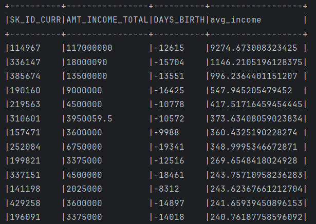

#### 全部代码

```scala
  def Task2_2(df: DataFrame): DataFrame = {
    //选取所需列
    val df1 = df.select("SK_ID_CURR", "AMT_INCOME_TOTAL", "DAYS_BIRTH")
    //添加一列：AMT_INCOME_TOTAL/DAYS_BIRTH
    val df2 = df1.withColumn("avg_income", col("AMT_INCOME_TOTAL").cast("Double") / (-col("DAYS_BIRTH").cast("Double")))
    //筛选出avg_income大于1的行并降序排列
    val df3 = df2.filter(col("avg_income") > 1).orderBy(col("avg_income").desc)
    df3.show(false)
    df3
  }
```

#### 在Spark WebUI中查看

 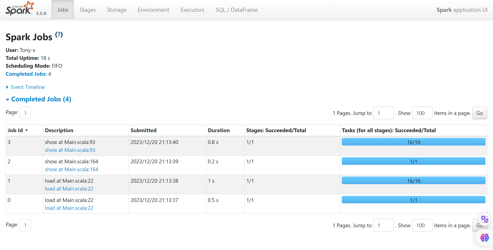

## 任务三

根据给定的数据集，基于Spark MLlib 或者Spark ML编写程序对贷款是否违约进⾏分类，并评估实验结果的准确率。可以训练多个模型，⽐较模型的表现。

本实验中选取的特征有：

```
"CNT_CHILDREN", "AMT_INCOME_TOTAL", "AMT_CREDIT", "NAME_CONTRACT_TYPE_index", "DAYS_BIRTH", "DAYS_EMPLOYED", "DAYS_REGISTRATION", "DAYS_ID_PUBLISH", "CODE_GENDER_index","FLAG_OWN_CAR_index", "FLAG_OWN_REALTY_index"
```

### Step1：数据预处理及特征提取

在本章节中，我们会将原数据进行数据预处理，并以此构造出特征向量。

1. 将String类型的数据编码为数值型数据

   由于原数据中的许多数据是String类型的，无法直接作为特征，所以需要先将其编码，这里使用的是`org.apache.spark.ml.feature.StringIndexer`将其转换成数值数据。

   ```scala
       // 将所需的string类型转换为数值类
       val columnsToIndex = Array("NAME_CONTRACT_TYPE", "CODE_GENDER", "FLAG_OWN_CAR", "FLAG_OWN_REALTY", "TARGET") // 列名数组
       val columnsToIndex_output = Array("NAME_CONTRACT_TYPE_index", "CODE_GENDER_index", "FLAG_OWN_CAR_index", "FLAG_OWN_REALTY_index", "label")//改变为数值型的数组
       val indexedColumns = columnsToIndex.zip(columnsToIndex_output).map { case (colName, output) =>
         //遍历上述列，分别构造StringIndexer
         new StringIndexer()
           .setInputCol(colName)
           .setOutputCol(s"${output}")
       }
       val indexedDF = indexedColumns.foldLeft(df) { (accDF, indexer) =>
         indexer.fit(accDF).transform(accDF)
       }
   ```

2. 将所有数值型数据向量化

   在将String类型的数据编码成数值型数据后，所有的特征都是数值型数据。下面使用 Spark ML 中的 `VectorAssembler` 构建特征向量。在机器学习中，特征向量是用来描述样本特征的一种形式，它将各个特征组合成一个向量，供机器学习模型使用。

   构造后数据如下图所示：

    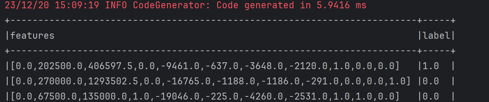

### Step2：划分训练集和测试集

本阶段比较简单，使用下列语句即可。

```scala
val Array(trainDF, testDF) = preprocessed_df.randomSplit(Array(0.8, 0.2))
```

### Step3：训练模型

由于有Spark ML的强大支持，只需要调包并设置参数即可。

```scala
val dt = new DecisionTreeClassifier()
  .setFeaturesCol("features")
  .setLabelCol("label")
  .setMaxBins(15)
  .setImpurity("gini")
  .setSeed(10)
// 训练模型
val dtModel = dt.fit(trainDF)
// 在测试集上预测
val testPredictions = dtModel.transform(testDF)
testPredictions
```

> - `.setMaxBins(15)`：指定最大的分箱数。在构建决策树时，数据会根据特征值的范围进行分箱处理。这里设置的最大分箱数为 15。
> - `.setImpurity("gini")`：指定用于分裂节点的不纯度度量方式。在决策树的构建中，"gini" 表示使用基尼不纯度进行分裂，用来衡量数据的纯度。
> - `.setSeed(10)`：设置随机种子，用于在构建决策树时引入随机性，有助于提高模型的泛化能力。

### Step4：评估模型效果

本阶段也比较简单，直接调用`import org.apache.spark.ml.evaluation.MulticlassClassificationEvaluator`即可。

```scala
//计算测试集召回率
val evaluator1 = new MulticlassClassificationEvaluator()
  .setMetricName("weightedRecall")
val recall = evaluator1.evaluate(testPredictions)
//计算测试集精确率
val evaluator2 = new MulticlassClassificationEvaluator()
  .setMetricName("weightedPrecision")
val precision = evaluator2.evaluate(testPredictions)
//计算测试集F1值
val evaluator3 = new MulticlassClassificationEvaluator()
  .setMetricName("f1")
val f1 = evaluator3.evaluate(testPredictions)
print("recall   : " + recall+"\n")
print("precision: " + precision+"\n")
print("f1-score : " + f1+"\n")
```

可以看见，使用决策树的预测贷款是否违约的模型效果如下：

 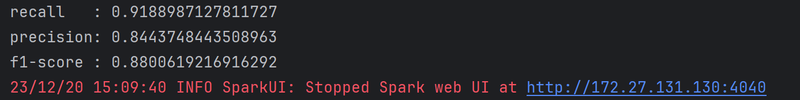

### 全部代码：

定义的函数：

```scala
  def Task3_get_preprocessed_df(df: DataFrame): DataFrame = {
    // 将所需的string类型转换为数值类
    val columnsToIndex = Array("NAME_CONTRACT_TYPE", "CODE_GENDER", "FLAG_OWN_CAR", "FLAG_OWN_REALTY", "TARGET") // 列名数组，你希望转换的列
    val columnsToIndex_output = Array("NAME_CONTRACT_TYPE_index", "CODE_GENDER_index", "FLAG_OWN_CAR_index", "FLAG_OWN_REALTY_index", "label")
    val indexedColumns = columnsToIndex.zip(columnsToIndex_output).map { case (colName, output) =>
      new StringIndexer()
        .setInputCol(colName)
        .setOutputCol(s"${output}")
    }
    val indexedDF = indexedColumns.foldLeft(df) { (accDF, indexer) =>
      indexer.fit(accDF).transform(accDF)
    }
    // 构建特征向量
    val assembler = new VectorAssembler()
      .setInputCols(Array("CNT_CHILDREN", "AMT_INCOME_TOTAL", "AMT_CREDIT", "NAME_CONTRACT_TYPE_index", "DAYS_BIRTH", "DAYS_EMPLOYED", "DAYS_REGISTRATION", "DAYS_ID_PUBLISH", "CODE_GENDER_index",
        "FLAG_OWN_CAR_index", "FLAG_OWN_REALTY_index"))
      .setOutputCol("features")
    val assembledDF = assembler.transform(indexedDF)
    //打印features和label列
    assembledDF.select("features", "label").show(false)
    assembledDF
  }
  def Model(trainDF: DataFrame,testDF:DataFrame): DataFrame = {
    // 创建决策树模型
    val dt = new DecisionTreeClassifier()
      .setFeaturesCol("features")
      .setLabelCol("label")
      .setMaxBins(15)
      .setImpurity("gini")
      .setSeed(10)
    //创建随机森林模型
//    val rf = new RandomForestClassifier()
//      .setFeaturesCol("features")
//      .setLabelCol("label")
//      .setNumTrees(10)
//      .setMaxBins(10)
//      .setImpurity("gini")
//      .setSeed(10)

    // 训练模型
    val dtModel = dt.fit(trainDF)

    // 在测试集上预测
    val testPredictions = dtModel.transform(testDF)
    testPredictions
  }
  def Evaluate(testPredictions: DataFrame): Unit = {
    //计算测试集召回率
    val evaluator1 = new MulticlassClassificationEvaluator()
      .setMetricName("weightedRecall")
    val recall = evaluator1.evaluate(testPredictions)
    //计算测试集精确率
    val evaluator2 = new MulticlassClassificationEvaluator()
      .setMetricName("weightedPrecision")
    val precision = evaluator2.evaluate(testPredictions)
    //计算测试集F1值
    val evaluator3 = new MulticlassClassificationEvaluator()
      .setMetricName("f1")
    val f1 = evaluator3.evaluate(testPredictions)
    print("recall   : " + recall+"\n")
    print("precision: " + precision+"\n")
    print("f1-score : " + f1+"\n")
  }
```

主函数调用：

```scala
//Task3
//数据预处理
val preprocessed_df=Task3_get_preprocessed_df(df)
//随机划分训练集和测试集
val Array(trainDF, testDF) = preprocessed_df.randomSplit(Array(0.8, 0.2))

// 训练模型
val testPredictions = Model(trainDF,testDF)
// 评估模型
Evaluate(testPredictions)
```

### 在Spark WebUI中查看

 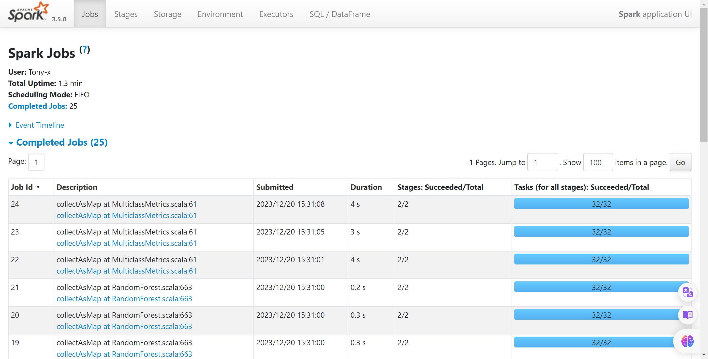

## 遇到的困难及解决方法

1. 在保存数据时报错：`java.io.FileNotFoundException: HADOOP_HOME and hadoop.home.dir are unset.`

   该问题可能是因为本次实验直接是在本机上跑的，本机上没有安装hadoop，在按照这篇文章安装hadoop和winutils后问题就解决了。文章[链接](https://blog.csdn.net/lvoelife/article/details/133349627?spm=1001.2101.3001.6650.3&utm_medium=distribute.pc_relevant.none-task-blog-2~default~YuanLiJiHua~Position-3-133349627-blog-124342759.235%5Ev39%5Epc_relevant_3m_sort_dl_base4&depth_1-utm_source=distribute.pc_relevant.none-task-blog-2~default~YuanLiJiHua~Position-3-133349627-blog-124342759.235%5Ev39%5Epc_relevant_3m_sort_dl_base4&utm_relevant_index=6)

2. 关于DataFrame

   在读取数据的时候，如果仅仅使用spark.read的话，会默认所有数据都是String类型，但如果加上`.option("header","true")`，就可以让读取的时候自动判别数据类型，减少了后续类型转化工作

3. 关于Spark WebUI

   如果用IDEA+Scala，程序在运行完就会立即关闭Spark端口，导致无法访问`localhost:4040`，我们可以在程序运行完毕后等待一会`Thread.sleep(1000000)`，就可以打开Spark端口

4. 关于一个dataframe在写入文件时出现多个csv文件

   Spark DataFrame在写入文件时，默认会根据数据的分区（partitions）来生成对应数量的文件，每个分区的数据会被写入一个单独的文件中。这在分布式计算环境下是为了更好地利用集群资源，提高数据的并行处理能力。如果DataFrame有多个分区，写入时就会生成多个文件。

   因此可以再写入时添加参数`.coalesce(1)`解决问题
